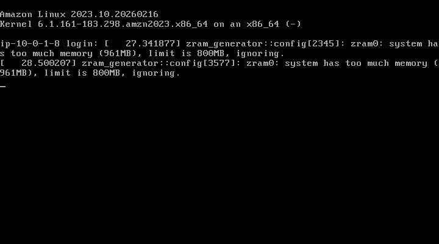

# Lab 3 – Introduction to Amazon Elastic Compute Cloud (EC2)

## Author

* **Name**: Elavarasan M
* **Register Number**: 212224040083
* **Date of Submission**: 27-02-2026

---

## Objective

The objective of this experiment is to understand the fundamentals of Amazon Elastic Compute Cloud (EC2). This lab focuses on launching and managing a virtual server, understanding instance types and AMIs, connecting to an EC2 instance, monitoring its status, and performing basic instance operations such as start, stop, and terminate.

---

## Prerequisites

* Basic understanding of cloud computing concepts
* AWS account or AWS Academy Lab access
* Web browser with internet connectivity
* Basic knowledge of Linux commands (optional)

---

## Tools Used

* AWS Management Console
* Amazon EC2
* Key Pair
* Security Group
* SSH Client (PuTTY / Terminal)

---

## Tasks Performed

### Task 1: Explore Amazon EC2 Dashboard

Explore the EC2 service dashboard in the AWS Management Console. Observe the different sections such as Instances, AMIs, Instance Types, Key Pairs, Security Groups, and Elastic IPs.

---

### Task 2: Launch an EC2 Instance

Launch a new EC2 instance using Amazon Linux 2 AMI. Select an appropriate instance type (t2.micro) under the free tier. Configure basic settings such as instance name, key pair, and security group.

---

### Task 3: Configure Security Group

Configure a security group to allow inbound access:

* SSH (Port 22) from your IP address
* HTTP (Port 80) from anywhere (0.0.0.0/0)

This security group acts as a firewall for the instance.

---

### Task 4: Connect to EC2 Instance

Connect to the running EC2 instance using SSH. Use the downloaded key pair and connect via terminal or PuTTY.

For Amazon Linux:

```
ssh -i "keyname.pem" ec2-user@<Public-IP>
```

---

### Task 5: Perform Basic Instance Operations

Perform the following operations from the EC2 console:

* Stop the instance
* Start the instance
* Reboot the instance

Observe the state changes of the instance.

---

### Task 6: Monitor EC2 Instance

Monitor the EC2 instance using the Monitoring tab. Observe metrics such as CPU utilization, network in/out, and instance status checks.

---

### Task 7: Terminate EC2 Instance

Terminate the EC2 instance after completing the experiment to avoid unnecessary AWS charges.

---

## Workflow (Student Explanation)

(Write the steps you followed in your own words)

1. .A Virtual Private Cloud (VPC) was created with the CIDR block 10.0.0.0/16 to provide a secure and isolated network environment in AWS.
2. .A public subnet was then created within the VPC using the CIDR block 10.0.1.0/24, and the auto-assign public IPv4 option was enabled to allow internet access for the instances launched inside it.
3. An Internet Gateway was created and attached to the VPC to enable internet connectivity. A route table was configured with a default route (0.0.0.0/0) pointing to the Internet Gateway, and this route table was associated with the public subnet.
4. A security group was created to allow inbound SSH (port 22) and HTTP (port 80) traffic. After configuring the security group, an EC2 instance was launched using the Amazon Linux 2 AMI. The instance was associated with the created security group and a key pair for secure access.
5. The EC2 instance was connected using SSH. The Apache HTTPD web server was installed and started on the instance


## Output Screenshots (Attach 3)

### Screenshot 1: EC2 Dashboard / Instance List

.png>)

### Screenshot 2: SSH Connection to Instance



### Screenshot 3: Instance Monitoring / Status

.png>)

.png>)


## Result 

This experiment provided hands-on experience with Amazon EC2 by demonstrating how to launch, connect, manage, and monitor a virtual server in AWS. It helped in understanding the concept of Infrastructure as a Service (IaaS) and how compute resources can be provisioned and controlled on demand in the cloud.
